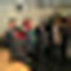
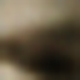
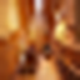
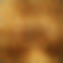
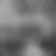
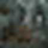
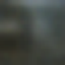
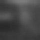

# VAEThumbnailKit

VAEThumbnailKit is a small Apple-platform Swift package for decoding versioned,
base64-packed VAE thumbnail payloads into displayable placeholder images.

The package ships two bundled decoders: the original grayscale
`placeholder_ae_v1` model under `placeholder_ae_v1_gray`, and a real RGB
`placeholder_ae_v2_rgb` model trained on a public Places365 small balanced
subset. The public surface stays small: pass a payload string in, optionally
pin a bundled model, and get a Core Graphics image out.

## Features

- Bundled CoreML decoders and metadata for `placeholder_ae_v1_gray` and `placeholder_ae_v2_rgb`
- Small Swift API with explicit input, configuration, output, and error types
- Explicit bundled-model hints plus automatic model selection
- Grayscale-first default behavior with an explicit future-facing color API
- No app-specific types, view models, or bundle assumptions in the package
- Payload-only tests; no private or third-party source images are shipped

## Requirements

- Xcode 16 or later
- Swift 5.10
- iOS 17+
- macOS 14+

## Installation

During local development, use a local path dependency:

```swift
dependencies: [
  .package(path: "../vae-thumbnail")
]
```

If you need an unreleased snapshot, pin a revision explicitly instead of tracking a branch:

```swift
dependencies: [
  .package(url: "https://github.com/mitchins/vae-thumbnail.git", revision: "<commit-sha>")
]
```

After the first semver release is tagged, prefer the normal version-based form:

```swift
dependencies: [
  .package(url: "https://github.com/mitchins/vae-thumbnail.git", from: "1.0.0")
]
```

Then add the product to your target:

```swift
.product(name: "VAEThumbnailKit", package: "vae-thumbnail")
```

## Usage

```swift
import VAEThumbnailKit

let generator = try VAEThumbnailGenerator()
let input = VAEThumbnailInput(
  latentPayload: "iHF9oYBndICMcZqMeXeZjwD/",
  model: .grayscaleV1
)
let output = try generator.generateThumbnailSynchronously(from: input)

#if canImport(UIKit)
let image = output.uiImage
#endif
```

You can also request a resized output image:

```swift
let configuration = VAEThumbnailConfiguration(
    outputSize: CGSize(width: 48, height: 48),
    colorMode: .automatic,
    quality: .best
)

let output = try generator.generateThumbnailSynchronously(
    from: input,
    configuration: configuration
)
```

When you have a real RGB v2 payload, `.automatic` will prefer the bundled color
decoder automatically:

```swift
let rgbInput = VAEThumbnailInput(latentPayload: "j5OydX+gm5Z2jHKJjYxpd5jCiLmSkFNq")
let rgbOutput = try generator.generateThumbnailSynchronously(from: rgbInput)
```

## Preview

Three samples are enough here. The BW column is the same sample rendered in grayscale, so the comparison stays aligned and quiet.

| Original | Color | BW |
| --- | --- | --- |
|  |  |  |
|  |  |  |
|  |  |  |

## Color Support

The bundled models now have different output capabilities.

- `placeholder_ae_v1_gray` is grayscale only.
- `placeholder_ae_v2_rgb` is a real three-channel decoder.
- `.automatic` chooses the best compatible bundled model and prefers color when a compatible RGB payload is available.
- `.grayscale` forces grayscale rendering, including when the underlying bundled model is color-capable.
- `.color` returns true color only when the payload bytes match a bundled RGB-capable model.
- `VAEThumbnailInput.model` can pin a specific bundled model such as `.grayscaleV1` or `.rgbV2` when the caller knows the payload version explicitly.

No fake tinting fallback is applied.

## Example CLI

The package includes a minimal executable example target:

```bash
swift run BasicThumbnailCLI \
  --payload iHF9oYBndICMcZqMeXeZjwD/ \
  --output /tmp/vae-thumbnail.png \
  --width 64 \
  --height 64
```

## Model Provenance

The bundled decoders and metadata are author-generated artifacts, but they do
not all share the same provenance.

- `placeholder_ae_v1_gray` is the legacy grayscale model retained for
  backward-compatible payloads.
- `placeholder_ae_v2_rgb` was trained on a public Places365 small validation
  subset capped to 32 images per class, then exported to CoreML.
- The shipped files live under `Sources/VAEThumbnailKit/Resources/Models/`.
- The training corpora themselves are not included in this repository.
- No private app credentials, analytics IDs, signing assets, or user images are
  included here.
- `placeholder_ae_v1_gray` still reflects the older grayscale payload contract.
- `placeholder_ae_v2_rgb` uses only public Places365 inputs and does not bundle
  any source images.

## Dataset Recipe

The RGB v2 model was built from a public dataset recipe that stays outside the
package bundle:

- source: Places365 `val` split with `small=True` (256px source images)
- balancing: cap to 32 images per class for 365 classes
- preprocessing: RGB conversion, square pad, resize to 16x16
- payload contract: 24 latent bytes, base64-encoded to 32 characters

The research scripts that prepare this dataset and export the model live under
`research/placeholders/src/` in the workspace.

## Limitations

- Existing grayscale payloads are still `placeholder_ae_v1` payloads unless and
  until the encoder contract is updated.
- Both bundled models currently target 16x16 square latent previews before client-side scaling.
- `placeholder_ae_v1_gray` remains in the package for backward compatibility, so public consumers should choose their payload/version contract explicitly.

## Development

```bash
make test
make lint
make sonar-coverage
```

The CI workflow runs SwiftFormat, SwiftLint, macOS package tests with coverage,
and SonarCloud analysis. The first public package tag is intended to be
`1.0.0`.

See [reports/extraction_summary.md](reports/extraction_summary.md) for the
extraction notes and measured impact.